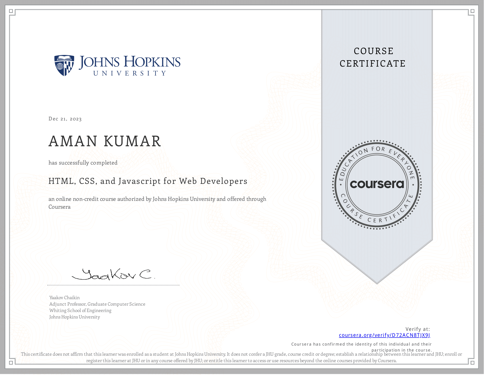

# Coursera-HTML-CSS-and-Javascript-for-Web-Developers
This repository contains all of the source code used in the course called HTML, CSS and Javascript for Web Developers in Coursera.

# Assignments :

* Module-1 - Quiz 
* Module-2 - Coding
* Module-3 - Coding
* Module-4 - Coding
* Module-5 - Coding

